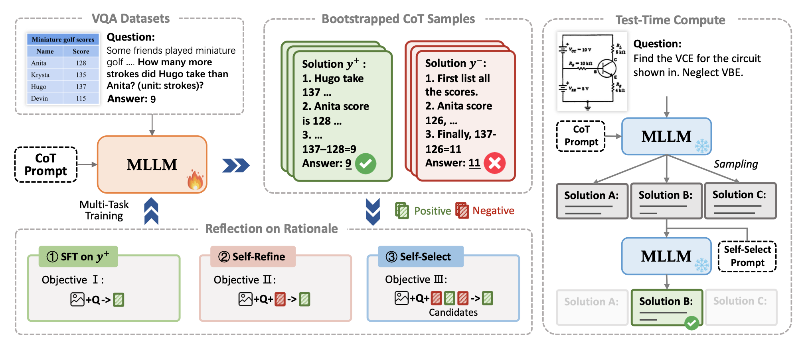

# Vision-Language Models Can Self-Improve Reasoning via Reflection

[](https://arxiv.org/abs/2411.00855) 
[](https://GitHub.com/Naereen/StrapDown.js/graphs/commit-activity) 
[](http://makeapullrequest.com)
[](https://awesome.re)

The code for the paper: [Vision-Language Models Can Self-Improve Reasoning via Reflection](https://arxiv.org/abs/2411.00855).
This repository contains code that reproduces the self-train results in our paper.
News: This paper was accepted by NAACL 2025.



***
### 🛠️ Installation & Environment

This codebase is build on [VL-RLHF](https://github.com/TideDra/VL-RLHF). Many thanks to their open-sourced work.

```
git clone https://github.com/njucckevin/MM-Self-Improve.git
cd MM-Self-Improve
pip install -e .
```

It is recommend to install FlashAttention for effective training and inference:

```
pip install flash-attn==2.5.8 --no-build-isolation
```

***
### 📝 Data&Model Preparation
This codebase currently provide code for VLM self-training on TabMWP, ChartQA and CLEVR-Math dataset.
To reproduce the result, we need to first download and unzip this three datasets ([TabMWP](https://box.nju.edu.cn/f/eee16cb342a9438ea3bb/), [ChartQA](https://box.nju.edu.cn/f/ec16069e71ef4c6f96e0/), [CLEVR-Math](https://box.nju.edu.cn/f/176938c3b84444718588/)), and put them under the `data/datasets` directory.
It should look like:

```
data
├── data_self_train
│   └── ...
└── datasets
    ├── tabmwp
    │   └── ...
    ├── chartqa
    │   └── ...
    └── clevr-math
        └── ...
```

Then, download the official checkpoint of [Qwen-VL-Chat](https://huggingface.co/Qwen/Qwen-VL-Chat) and [LLaVA-1.5](https://huggingface.co/llava-hf/llava-1.5-7b-hf) from huggingface 🤗.

***
### 🚀 Self-Training
Run the following command to launch our self-training of QwenVL-Chat using CLEVR-Math dataset.
```
python self_train.py --model_name qwenvl --model_ckpt your_qwenvl_ckpt_dir/Qwen-VL-Chat --dataset_name clevr --dataset_dir ./data/datasets/clevr-math --gpu_ids 0,1,2,3,4,5,6,7
```
- model_name: `qwenvl` or `llava`, training with Qwen-VL-Chat or LLaVA-1.5.
- model_ckpt: the model checkpoint of Qwen-VL-Chat or LLaVA-1.5 downloaded above.
- dataset_name: `tabmwp`, `clevr` or `chartqa`, the self-training dataset.
- dataset_dir: the corresponding dataset directory.
- gpu_ids: the id of gpus you wish to use.

The script will start iteratively self-training and save a log file below `./log` to record the training process, including dataset statistics and evaluation metrics.

***
### 🚩 Qwen2-VL Results & Scaling of Test-Time Compute
To validate the generalizability of our framework, we applied it to [Qwen2-VL](https://github.com/QwenLM/Qwen2-VL), a recently released advanced MLLM. 
It also demonstrate the ability of our framework to boost the reasoning performance of MLLM through scaling test-time compute.
See details in this [repo](https://github.com/Liac-li/MM-self-improve-qwen2vl).

***
### Citation
If you find this work helpful, please consider to star 🌟 this repo and cite our paper.
```
@article{cheng2024vision,
  title={Vision-Language Models Can Self-Improve Reasoning via Reflection},
  author={Cheng, Kanzhi and Li, Yantao and Xu, Fangzhi and Zhang, Jianbing and Zhou, Hao and Liu, Yang},
  journal={arXiv preprint arXiv:2411.00855},
  year={2024}
}
```
Additionally, this project is build on the VL-RLHF framework.
```
@misc{vlrlhf,
  title = {VL-RLHF: A RLHF Infrastructure for Vision-Language Model},
  author = {Gongrui Zhang},
  howpublished = {\url{https://github.com/TideDra/VL-RLHF}},
  year = {2024}
}
```


